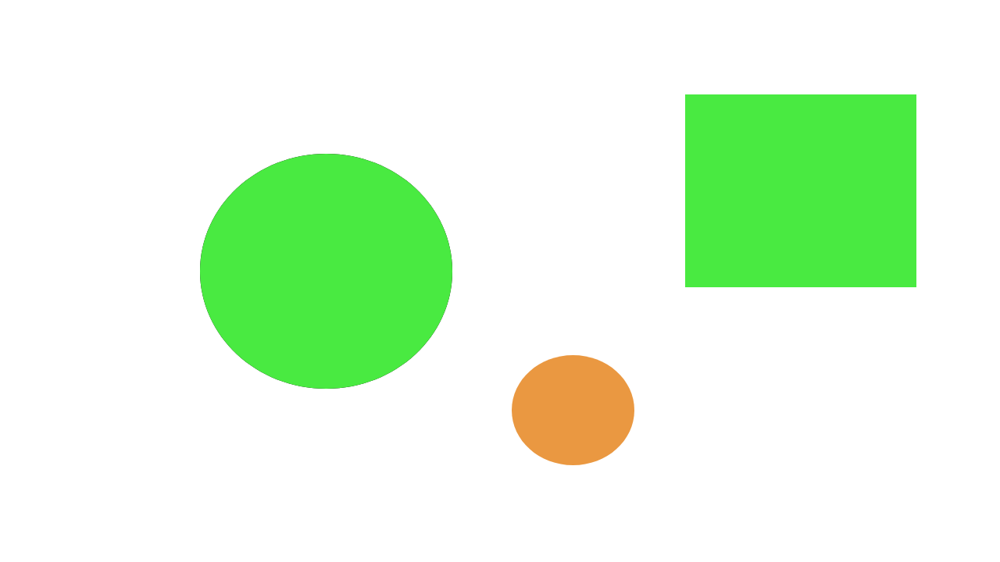
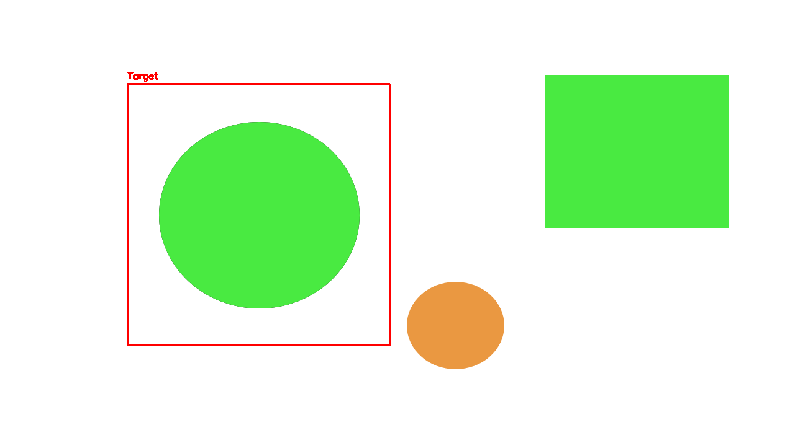

# BLOB DETECTION Assignment

## Introduction

The supplementary python material is so that you’re familiar with the
language itself. This tutorial is to learn about one specific library
this team utilizes often: OpenCV and a common sensor we use in our
projects: stereo camera.

Why do we use a stereo camera?

The primary reason is for depth estimation. Let’s say there is a human
standing in the road and we want to stop before we hit him. You can
imagine it would be useful to know how far we are from that person.
Stereo cameras allow us to have this information. You can think of them
as the “eyes” of a human driver.

## Getting Started

### Python Virtual Enviornment (venv)

A common practice that most python programmers use is creating a virtual
environment. This ensures we are running the correct version of a
package regardless of what is already on the system.

To create a virtual environment use the following command (you should
already have python installed):

`python3 -m venv venv`

To activate the virtual environment:

`source venv/bin/activate`

### ZED SDK Installation (in a venv)

[Download the ZED SDK](https://www.stereolabs.com/developers/release)

[Install the python API](https://www.stereolabs.com/docs/app-development/python/install)

The script to install the python API will be the ZED SDK installation
folder, Make sure you install it while your in your activated virtual
environment.

Its recommended you at least install the sample tutorials that the ZED
sdk provides as a reference for this assignment and any future projects
using the ZED.

## Project

*P1*: Use the OpenCV library to detect the big green circle only. Draw a
bounding box around it! Break down the elements that uniquely identify
the target (the big green circle). It is highly recommended you use
[this function](https://learnopencv.com/blob-detection-using-opencv-python-c/):

Output should look like:

*P2*: Print out the image you were originally provided and place it far
away from the ZED camera. Use the python ZED API and your code from P1
to estimate the distance from the stereo camera to the target. Print
this distance out.

**Helpful Info**:

- The ZED cameras can be found in room 701.
- [How to use OpenCV with the ZED](https://www.stereolabs.com/docs/opencv/python)
- [Depth Stabilization Parameters](https://www.stereolabs.com/docs/depth-sensing/depth-settings)

*P3*: Once you are detecting the proper shape and the distance from it,
measure the distance using a tape measure from the left lens of the zed
to the object. Report the percent error of the true distance (tape
measurer) and the estimated distance (your answer from P2).

**Note**: Note: If the ZED is giving inaccurate readings that is because
it has a falloff in accuracy at close ranges so try moving the image
back.
https://support.stereolabs.com/hc/en-us/articles/206953039-How-does-the-ZED-work
